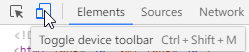
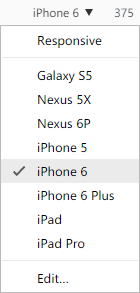
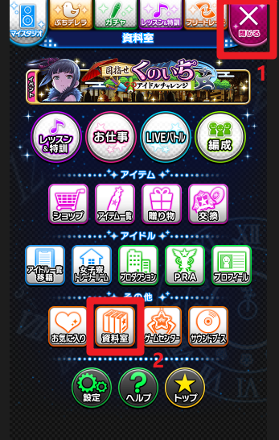
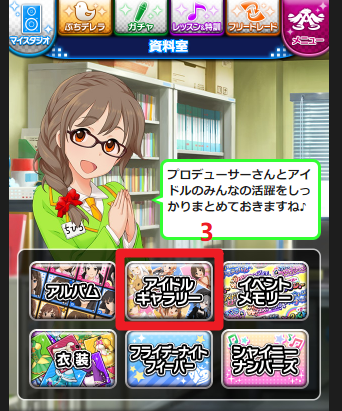
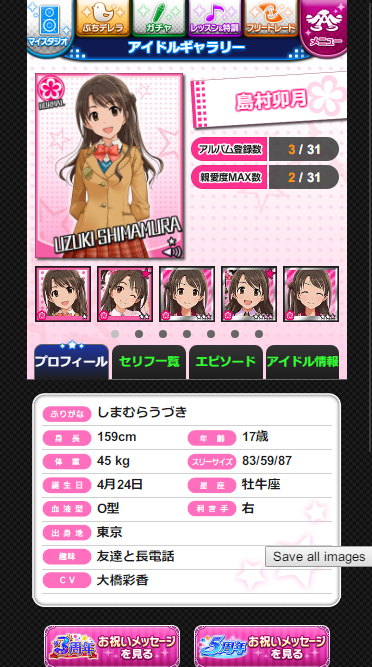

# Cinderella Girls Gallery Enhance
Unlocking galley and providing cards download for the social network game THE IDOLM@STER Cinderella Girls.

## Install
[Greasemonkey](https://addons.mozilla.org/zh-CN/firefox/addon/greasemonkey/) for Firefox or
[Tampermonkey](https://chrome.google.com/webstore/detail/tampermonkey/dhdgffkkebhmkfjojejmpbldmpobfkfo) for Chrome
is needed.

Then click [here](https://github.com/Yoctillion/CinderellaGirlsGalleryEnhance/raw/master/gallery-enhance.user.js) to install the script.

## How to use
This script **DOESN'T** support ChromeAPP version. Instead, it needs to be executed under mobile device simulation mode.  
To enable device simulation, you need to press `F12` / `Ctrl` + `Alt` + `I`,  
then click `Toggle device toolbar` (`Ctrl` + `Shift` + `M`),  
  
and select a mobile device (Chrome).  

Login game (URL: http://sp.pf.mbga.jp/12008305), navigate メニュー > 資料室 > アイドルギャラリー,  

  
select an idol, and all cards will be unlocked. Click "Save all images" button will download a zip file that contains all large card images.  

## BUG
If you try to view a card with premium sign which you don't own, the sign will not shine and an exception will happen.

## License
[The MIT License (MIT)](https://github.com/Yoctillion/CinderellaGirlsGalleryEnhance/blob/master/LICENSE)
